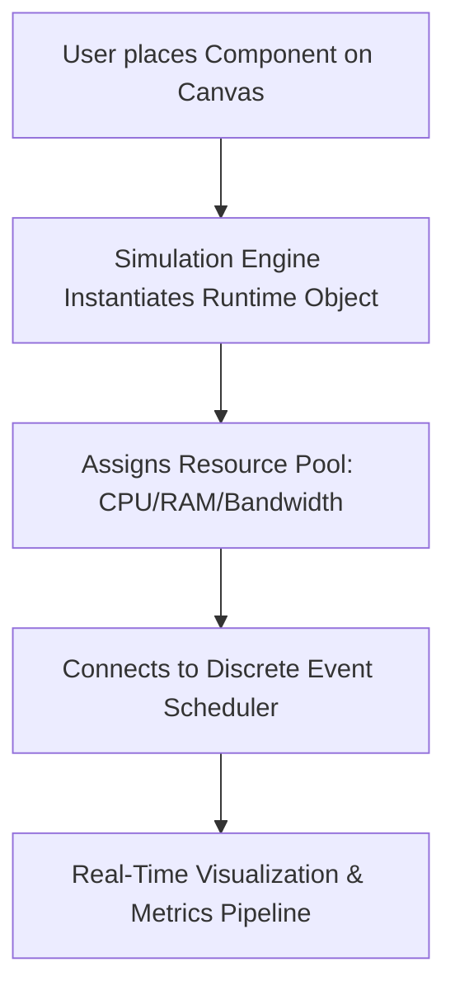

# ArchSim Vision

## 1. Executive Summary
**ArchSim** is a professional-grade, interactive distributed systems simulator designed to bridge the gap between static architecture diagrams and live running systems. While traditional tools allow engineers to draw software designs, they fail to demonstrate how these systems behave under load, during network partitions, or under resource constraints. 

ArchSim models every architectural component as a living entity with real-time state, metrics, resource consumption, and failure modes. It is built to serve as an educational platform, an interactive sandbox for system design interviews, and a system behavior prototyping tool for software architects.

## 2. The Core Problem
In software engineering, distributed systems design is historically taught through static whiteboards, text-heavy books, or post-mortem incident reports. These mediums suffer from major shortcomings:
* **The "Teleportation" Illusion**: Diagrams show arrows connecting boxes, implying that data travels instantly and error-free.
* **Invisible State**: A database icon does not show its connection pool exhaustion, CPU usage, or replication lag until it causes an outage.
* **Passive Learning**: Engineers read about cascading failures (e.g., thundering herd, circuit breaker trip) but cannot safely interact with or trigger them in real time.
* **Costly Prototyping**: Setting up a multi-region Kubernetes cluster with failure injection just to test a recovery scenario is time-consuming and expensive.

## 3. The ArchSim Vision
ArchSim transforms static diagrams into **dynamic execution models**. By placing a component on the canvas, the user creates a running software simulation thread. 

Every user action (e.g., changing database replication mode, reducing connection pool size, or cutting a network link) immediately alters the simulation's state machine, triggering realistic and observable side-effects.

---

## 4. Key Differentiators

| Feature | Drawing Tools (Figma/Excalidraw) | Hardware Emulators (GNS3/Mininet) | ArchSim |
| :--- | :--- | :--- | :--- |
| **Primary Focus** | Static Layouts / Documentation | Low-level network emulation | High-level distributed system behavior |
| **Execution** | None (Static) | Runs real VMs / OS Kernels (Heavy) | Event-driven mathematical model (Lightweight/Fast) |
| **Failure Modeling** | Manual text labels | Complex scripting / Interface shutdown | Point-and-click chaos engineering |
| **Telemetry** | None | Raw packet captures | Dashboard-level metrics (P99, CPU, Hit Ratio) |
| **Learning Path** | Drawing symbols | Networking protocols | Distributed system patterns (Caching, Retries, Raft) |

---

## 5. Scope: The Six Independent Engines
ArchSim's architecture is divided into six specialized engines, each with single-responsibility constraints:

### 5.1. Canvas Engine
An infinite visual canvas built with React and WebGL/WebGPU wrapper technologies to ensure performance with up to 100,000+ nodes. It manages rendering, zooming, panning, layout, snapping, and smart connections. Crucially, the Canvas Engine is completely decoupled from the simulation state—it is purely a visual viewer.

### 5.2. Component Engine
The registry and state-management system for all software entities (VMs, Load Balancers, Redis, PostgreSQL, Kafka, etc.). Every component manages its own lifecycle, parameters (e.g., thread pool limit, capacity), and current resource usage.

### 5.3. Network Engine
The virtual internet routing layer. Packets travel along connections with real-world characteristics: bandwidth limits, latency, jitter, packet loss, and protocol overhead (TCP handshakes, TLS negotiation, DNS lookup).

### 5.4. Simulation Engine
The core execution engine. Uses a deterministic Discrete Event Simulator (DES) scheduler to process requests, manage asynchronous queues, trigger autoscaling events, process database transactions, and execute replication protocols.

### 5.5. Metrics Engine
A high-frequency metrics aggregator that collects resource usage (CPU, Memory, Disk IOPS) and traffic performance (QPS, Error Rates, Latency percentiles: P50, P95, P99). It routes these metrics to the visual dashboards.

### 5.6. Collaboration Engine
Enables multiplayer mode using Conflict-Free Replicated Data Types (CRDTs) to synchronize canvas state, component configurations, and simulation sessions across multiple concurrent users in real time.

---

## 6. Non-Goals
To maintain product focus, ArchSim explicitly excludes the following capabilities:
* **Operating System Emulation**: ArchSim does not run actual binary code (e.g., x86/ARM instructions). It does not emulate kernel scheduling, physical page tables, or raw CPU registers.
* **Low-Level Network Packet Emulation**: It does not simulate binary packet headers down to the bit-level (e.g., ethernet frames, IP headers) or act as a Wireshark replacement. It works at the logical message and protocol state level.
* **Production Deployment (IaC Output)**: It is not a deployment wizard. It does not compile into production Kubernetes manifests or AWS CloudFormation templates (though exporting simplified representations is possible).
* **Static Whiteboard/General Diagramming**: It does not support freeform drawing, text boxes, or generic shapes. Every element on the canvas must map directly to a simulator component.
