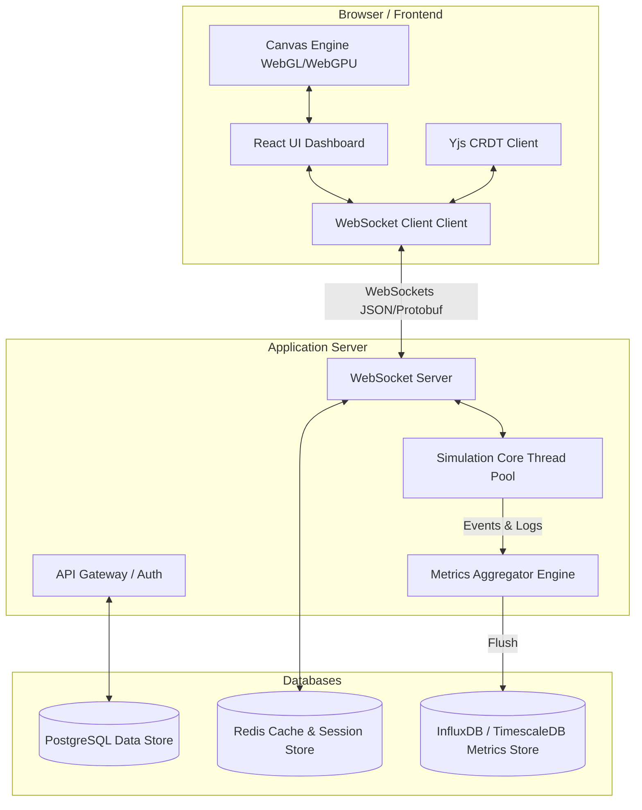

# ArchSim System Architecture Specification

This document provides a technical overview of the system architecture of ArchSim.

---

## 1. High-Level Architecture
ArchSim is structured as a decoupled multi-tier web application, optimized for low-latency visual rendering on the frontend and deterministic simulation processing on the backend.

---

## 2. Core Subsystems

### 2.1. Client Layer
The client is a React application written in TypeScript.
* **UI Shell**: Renders configuration panels, dashboard charts, the inspector panel, and timeline controls.
* **Canvas Renderer**: Utilizes WebGL (via pixi.js or custom shaders) for rendering animated network packets, lines, status indicators, and background grids, while rendering node layout cards using SVG/HTML layers for absolute pixel clarity.
* **CRDT Coordinator**: Utilizes Yjs to coordinate collaborative real-time editing. Canvas changes, node movements, and configuration shifts are synchronized as delta updates rather than full-page state writes.

### 2.2. Backend Application Server (Spring Boot)
The backend manages session persistence, deterministic simulation calculations, and real-time collaboration.
* **REST API Layer**: Manages user authentication, project configuration saves, templates retrieval, and interview task evaluations.
* **WebSocket Server**: Acts as the real-time communication channel. Delivers updates for multiplayer editing and streams high-frequency simulation metrics (e.g., node resource usage) to active visual clients.
* **Simulation Core**: A Java execution thread running an event scheduler. It processes events deterministically, calculating queues, network delays, CPU cycles, and database transactions at virtual-time ticks.

### 2.3. Data Storage Layer
* **PostgreSQL**: Used for relational data that requires high transactional integrity, including user details, project schemas, templates, and saved architectures.
* **Redis**: Used as a low-latency cache, WebSocket subscription registry, and temporary session store for collaborative multiplayer sessions.
* **TimescaleDB / InfluxDB**: A specialized time-series database configured to ingest high-frequency telemetry metrics from simulated components (CPU, RAM, connection stats) to support historical timeline analysis.
