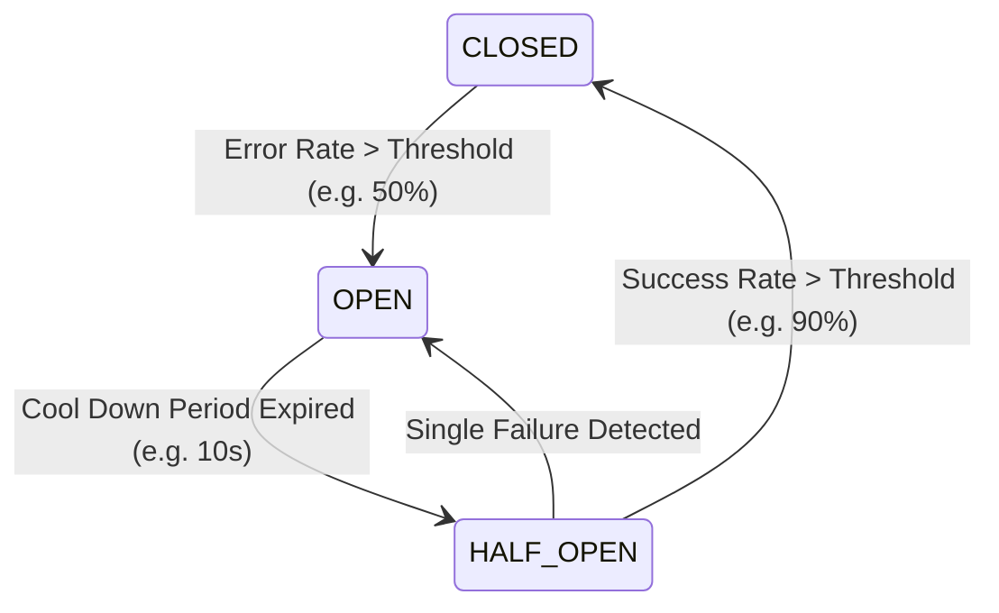

# ArchSim Simulation Algorithms Specification

This document details the algorithms and calculations used for network routing, rate limiting, and circuit breakers.

---

## 1. Network Routing Algorithms

### 1.1. Dijkstra Shortest Path routing
Used to route request packets across complex topologies. Paths are calculated using edge weights:
$$\text{Weight} = \text{Link Latency} \times \left(1.0 + \frac{\text{Current Throughput}}{\text{Link Bandwidth}}\right)$$
This formula ensures that packets naturally route around congested lines.

### 1.2. ECMP (Equal-Cost Multi-Path)
Used by load balancers. When multiple paths share the same cost, requests are hashed based on source IP and target port to distribute traffic.

---

## 2. Rate Limiting Algorithms

### 2.1. Token Bucket Algorithm
Often applied to gateways and API boundaries. 
* **Bucket Capacity ($B$)**: Maximum burst size.
* **Refill Rate ($r$)**: Tokens added per second.
* **Mathematical Check**: At time $t$, with current tokens $T(t)$, checking a request requiring $1$ token:
  $$T(t) = \min(B, T(t_{\text{last}}) + r \times (t - t_{\text{last}}))$$
  $$T(t) \ge 1 \implies \text{Request Allowed}, \quad T(t) \leftarrow T(t) - 1$$
  $$T(t) < 1 \implies \text{Request Rejected (HTTP 429 Too Many Requests)}$$

### 2.2. Leaky Bucket Algorithm
Requests drip into a bucket. The bucket leaks at a constant rate. Excess traffic is buffered, creating smooth outbound traffic rates but increasing request queuing delays.

### 2.3. Sliding Window Counter Rate Limiter
Tracks request frequencies dynamically across window boundaries. For a window of duration $W$ and rate limit $L$, at timestamp $t$, let the previous window request count be $N_{\text{prev}}$ and the current window count be $N_{\text{curr}}$:

$$\text{Fraction}_{\text{prev}} = 1.0 - \frac{t \bmod W}{W}$$
$$\text{Estimated Requests} = N_{\text{prev}} \times \text{Fraction}_{\text{prev}} + N_{\text{curr}}$$

$$\text{Estimated Requests} \le L \implies \text{Request Allowed}, \quad N_{\text{curr}} \leftarrow N_{\text{curr}} + 1$$
$$\text{Estimated Requests} > L \implies \text{Request Rejected (HTTP 429)}$$

---

## 3. Circuit Breaker & Bulkhead Design

### 3.1. Circuit Breaker State Machine
Simulates the standard Netflix Hystrix / Resilience4j behavior:

* **CLOSED**: Normal operation. Requests flow downstream.
* **OPEN**: High error rates detected. The circuit trips. All subsequent calls immediately fail-fast (returning fallbacks or errors without calling downstream services).
* **HALF-OPEN**: Tests downstream health with a small subset of trial traffic.

### 3.2. Bulkhead Partitioning (Resource Isolation)
Isolates critical resource pools to prevent failure cascades. For a system processing requests across $K$ downstream service channels, each channel is allocated a separate thread pool of size $C_k$ and a queue size $Q_k$.
At tick $t$:
$$\text{Active Threads}_k(t) + \text{Queued Requests}_k(t) \ge C_k + Q_k \implies \text{Incoming requests for channel } k \text{ are rejected fast}$$
This ensures that if channel $A$ is blocked, other channels (e.g., $B$, $C$) continue to operate unimpeded on their independent thread resources.

