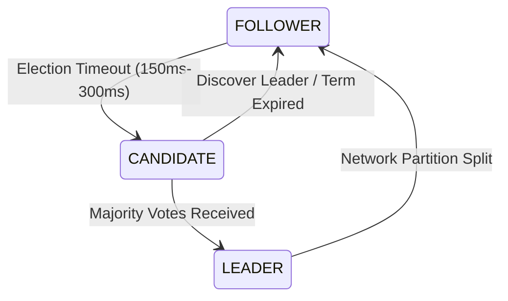

# ArchSim Database Replication Specification

This document details the simulation of primary-replica replication, consensus algorithms (Raft), write routing, and failover scenarios.

---

## 1. Replication Mechanics & Lag

### 1.1. Synchronous vs. Asynchronous Replication
When a write transaction arrives at the Primary database node, the simulator routes replication payloads:

#### Synchronous Mode
The primary write transaction waits for all synchronous replicas to write the log:
$$T_{\text{write\_sync}} = T_{\text{write\_primary}} + \max_{r \in \text{Sync Replicas}} (2 \times T_{\text{transit\_r}} + T_{\text{write\_replica\_r}})$$
* **Risk**: Slow network links to a replica will directly increase primary write latency.

#### Asynchronous Mode
The write transaction commits immediately on the primary. Replication logs are scheduled as background events:
$$\text{Replication Lag}_r(t) = \text{Bytes Committed}_{\text{primary}} - \text{Bytes Applied}_{\text{replica\_r}}$$

---

## 2. Write Routing & Read Replicas
Clients or microservices route database queries depending on configuration:
* **Writes**: Always routed to the `PRIMARY` database node.
* **Reads**: Distributed across `REPLICAS` using Load Balancing rules (e.g. Round-Robin).
* **Stale Read Simulation**: If client query hits a replica with $\text{Replication Lag}_r > \text{Stale Threshold}$, the query returns old data.

### 2.1. Replication Lag during Network Partitions
If a replica $r$ is partitioned from the primary database node, the replication lag grows over time based on the active write throughput:

$$\text{Replication Lag}_r(t) = \text{Replication Lag}_r(t_p) + \int_{t_p}^{t} R_{\text{write}}(\tau) \, d\tau$$

Where $t_p$ is the start timestamp of the partition event, and $R_{\text{write}}(\tau)$ is the write traffic throughput (in bytes/sec) committed to the primary at time $\tau$. Once the partition heals, replication catches up based on the link bandwidth limit:

$$\frac{d}{dt}\left[\text{Replication Lag}_r(t)\right] = R_{\text{write}}(t) - \min\left(R_{\text{write}}(t), \frac{B_{\text{link\_r}}}{\text{Replication Overhead Factor}}\right)$$

---

## 3. Consensus Protocols & Failover (Raft)
For multi-node database clusters (e.g. Cassandra, CockroachDB, or HA Postgres), ArchSim simulates Raft leader election processes:

* **Heartbeat Periodicity**: Leaders send periodic sync frames every $50\text{ms}$.
* **Leader Crash**: If the leader fails or gets partitioned, followers detect missing heartbeats after an election timeout ($150\text{ms} - 300\text{ms}$) and transition to candidates.
* **Consensus Delay**: Dynamic leader promotion takes time ($T_{\text{consensus}} \approx 100\text{ms} - 500\text{ms}$), during which the cluster rejects new write requests.

### 3.1. Raft Safety Invariants
The simulation validates and enforces five core Raft safety invariants:
1. **Election Safety**: At most one leader can be elected in a given term:
   $$N_{\text{leaders}}(\text{term}) \le 1$$
2. **Leader Append-Only**: A leader never overwrites or deletes its entries; it only appends new entries.
3. **Log Matching**: If two logs contain an entry with the same index and term, then they are identical in all entries up through the given index.
4. **Leader Completeness**: If a log entry is committed in a given term, that entry will be present in the logs of the leaders for all higher-numbered terms.
5. **State Machine Safety**: If a server has applied a log entry at a given index to its state machine, no other server will ever apply a different log entry for the same index.

