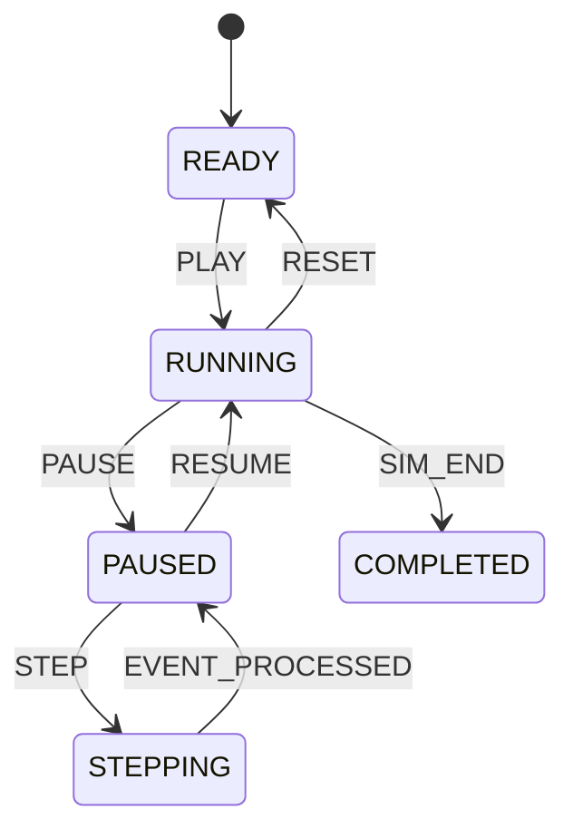

# ArchSim Time Engine Specification

This document details the time synchronization models, virtual clock management, and deterministic speed scaling algorithms used in ArchSim.

---

## 1. Virtual Time vs. Wall-Clock Time
In ArchSim, simulation execution is decoupled from the wall-clock execution time of the host system. The simulator maintains a 64-bit integer virtual clock ($T_{\text{virtual}}$) representing the elapsed time since the simulation began, measured in milliseconds.

$$\Delta T_{\text{virtual}} = \Delta T_{\text{wall}} \times \text{Speed Factor}$$

### 1.1. Clock Resolution & Frequency
* **Virtual Tick Resolution**: $1\text{ millisecond}$.
* **Max Speed Factor**: Up to $10,000\times$ (allows simulating a full 24-hour day in $8.64\text{ seconds}$).
* **Dynamic Time Stepping**: When the event queue is empty, the Virtual Clock skips directly to the scheduled execution time of the next event in the queue, preventing unnecessary CPU spin cycles.

---

## 2. Playback State Machine
The Time Engine manages the simulation state machine, which is synchronized across the backend and the browser client:

* **READY**: Simulation clock is set to $T_{\text{virtual}} = 0$. Event queue is initialized with traffic profiles.
* **RUNNING**: Events are actively processed by the Discrete Event Scheduler.
* **PAUSED**: The clock is frozen. No events are pulled from the scheduler queue, though client metrics queries can still access historical records.
* **STEPPING**: The scheduler processes exactly one tick or event group, increments $T_{\text{virtual}}$ by the corresponding delta, and returns to `PAUSED` mode.

---

## 3. Deterministic Seed-Based Execution
To ensure reproducibility for tutorials, system design interviews, and debugging:
* **Random Engine**: All stochastic calculations (such as network latency jitter, packet drops, database lock contention timings, or cache hit probabilities) are governed by a deterministic pseudo-random number generator (PRNG) initialized with a 64-bit seed.
* **PRNG Algorithm**: LCG (Linear Congruential Generator) or PCG (Permuted Congruential Generator) to guarantee that the same seed and input layout produce identical logs and metrics graphs across runs:
  $$X_{n+1} = (a X_n + c) \bmod m$$
