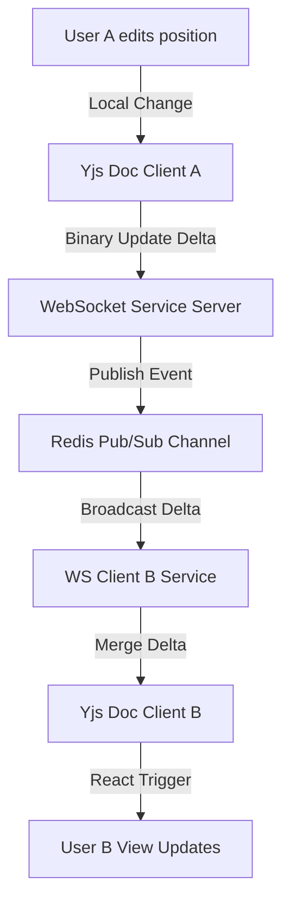

# ArchSim Collaboration Engine Specification

This document details the architecture, conflicts resolution, and synchronization logic used to support real-time collaborative workspace editing.

---

## 1. Collaborative Model Strategy (Yjs Integration)
ArchSim integrates **Yjs**, a high-performance Conflict-Free Replicated Data Type (CRDT) framework, to synchronize state updates.
* **Canvas State Model**: The canvas layout is modeled as a shared Yjs Map (`Y.Map`).
  * `nodes`: Map of node ID to `Y.Map` containing properties, position coordinates, and runtime configuration parameters.
  * `links`: Map of link ID to `Y.Map` containing connection properties.
  * `metadata`: Project name, canvas grid spacing, regions.

---

## 2. Server-side State Merging
To prevent client-state drift and persist canvas configurations:
* The backend maintains a headless node process or a Java Yjs port (`y-java`) that holds the master document in memory.
* When clients send binary update vectors (`Uint8Array` format), the server:
  1. Applies the update to the server-side Yjs document.
  2. Broadcasts the update payload to other active room connection sockets.
  3. Triggers a debounced database write timer ($5\text{ seconds}$ delay) to serialize the merged state as JSON and write it to the PostgreSQL `canvas_states` table.

---

## 3. Conflict Resolution
* **Concurrent Position Edits**: If User A and User B concurrently move the same server card node to different positions, Yjs merges the edits using built-in lamport clocks. The user with the higher client identifier wins, and both view ports settle on a single final position coordinate.
* **Property Overwrites**: Changes to slider configurations (e.g. database pool limits) are applied sequentially. The update with the latest virtual time stamp overwrites the other.
* **Concurrent Sever & Edit**: If User A deletes a connection link while User B is modifying its properties, the deletion takes precedence, and the connector is purged from the shared model.
